# Functional Process: DSL Parsing

**Process ID:** `dsl_parsing`
**Type:** Functional/Technical Process
**Version:** 1.0.0
**Date:** 2026-03-16

---

## 📋 Описание

Процесс парсинга DSL правил в абстрактное синтаксическое дерево (AST) для дальнейшего вычисления.

**Входные данные:**
- DSL текст (String): `"LANGUAGE = ru-RU -> https://example.ru; LANGUAGE = en-US -> https://example.com"`
- Context (IContext): контекст с данными запроса

**Выходные данные:**
- AST дерево (IRulesSet): объект для вычисления правил
- Или ошибка парсинга (ParseError)

---

## 🔄 Диаграмма процесса

```mermaid
flowchart TB
    Start([DSL String])

    %% Preprocessing
    Trim["Trim()<br/>Удалить пробелы"]
    CheckEmpty{"Пустая<br/>строка?"}

    %% Tokenization
    Split["SplitRespectingParentheses()<br/>Разбить по ;"]
    ParseRules["Для каждого правила:<br/>Parse Rule"]

    %% Rule Parsing
    FindArrow["Найти -><br/>Separator"]
    CheckArrow{"Найден<br/>->?"}
    ExtractURL["Извлечь URL<br/>после ->"]
    ExtractCondition["Извлечь Condition<br/>до ->"]

    %% Condition Parsing
    ParseCondition["ParseOrExpression()<br/>Рекурсивный спуск"]

    subgraph RecursiveDescent["Recursive Descent Parser"]
        direction TB
        OrExpr["ParseOrExpression()<br/>Проверить OR"]
        AndExpr["ParseAndExpression()<br/>Проверить AND"]
        PrimaryExpr["ParsePrimaryExpression()<br/>Перебор парсеров"]

        OrExpr --> AndExpr
        AndExpr --> PrimaryExpr
    end

    %% Primary Expression
    IterateParsers["Итерация по<br/>зарегистрированным<br/>парсерам"]
    TryParse{"Parser->Parse()<br/>успешен?"}
    CreateAST["Создать AST узел<br/>(IBoolExpression)"]
    NextParser["Следующий<br/>парсер"]

    %% Results
    BuildRuleSet["Собрать все правила<br/>в RulesSet"]
    ResultSuccess["✅ IRulesSet<br/>готов к Evaluate()"]
    ErrorNoArrow["❌ Error:<br/>Missing ->"]
    ErrorNoParse["❌ Error:<br/>Unknown expression"]

    End([Return Result])

    %% Main Flow
    Start --> Trim
    Trim --> CheckEmpty
    CheckEmpty -->|"Да"| ErrorNoParse
    CheckEmpty -->|"Нет"| Split

    Split --> ParseRules

    %% Rule Parsing Flow
    ParseRules --> FindArrow
    FindArrow --> CheckArrow
    CheckArrow -->|"Нет"| ErrorNoArrow
    CheckArrow -->|"Да"| ExtractURL
    ExtractURL --> ExtractCondition

    ExtractCondition --> ParseCondition
    ParseCondition --> RecursiveDescent

    %% Recursive Descent Flow
    RecursiveDescent --> PrimaryExpr
    PrimaryExpr --> IterateParsers

    IterateParsers --> TryParse
    TryParse -->|"Успех"| CreateAST
    TryParse -->|"Неудача"| NextParser
    NextParser -->|"Есть еще"| TryParse
    NextParser -->|"Все перебраны"| ErrorNoParse

    CreateAST --> BuildRuleSet
    BuildRuleSet --> ResultSuccess

    ResultSuccess --> End
    ErrorNoArrow --> End
    ErrorNoParse --> End

    %% Styling
    classDef inputStyle fill:#e3f2fd,stroke:#1565c0,stroke-width:3px
    classDef processStyle fill:#f3e5f5,stroke:#4a148c,stroke-width:2px
    classDef decisionStyle fill:#fff3e0,stroke:#e65100,stroke-width:2px
    classDef subgraphStyle fill:#e8f5e9,stroke:#2e7d32,stroke-width:2px
    classDef successStyle fill:#c8e6c9,stroke:#388e3c,stroke-width:3px
    classDef errorStyle fill:#ffcdd2,stroke:#d32f2f,stroke-width:2px
    classDef endStyle fill:#e1f5fe,stroke:#0277bd,stroke-width:3px

    class Start,End inputStyle
    class Trim,Split,ParseRules,FindArrow,ExtractURL,ExtractCondition,ParseCondition,IterateParsers,CreateAST,BuildRuleSet processStyle
    class CheckEmpty,CheckArrow,TryParse decisionStyle
    class OrExpr,AndExpr,PrimaryExpr subgraphStyle
    class ResultSuccess successStyle
    class ErrorNoArrow,ErrorNoParse errorStyle
```



---

## 📝 Технические детали

### Этап 1: Preprocessing

**Функция:** `CombinedParser::Parse()`

```cpp
// src/dsl/parser/combined_parser.cpp
std::string trimmed = Trim(dsl_text);

if (trimmed.empty()) {
    return ParseResult::Failure("Empty DSL text");
}
```

**Цель:** Удалить лишние пробелы, проверить на пустую строку.

---

### Этап 2: Tokenization

**Функция:** `SplitRespectingParentheses()`

```cpp
// Разбить по ; с учетом скобок
std::vector<std::string> rules_text = SplitRespectingParentheses(trimmed, ';');

// Пример:
// Input:  "LANGUAGE = ru-RU -> url1; (LANG = en OR LANG = de) -> url2"
// Output: ["LANGUAGE = ru-RU -> url1", "(LANG = en OR LANG = de) -> url2"]
```

**Цель:** Разбить DSL на отдельные правила, уважая вложенные скобки.

---

### Этап 3: Rule Parsing

**Функция:** Для каждого правила

```cpp
for (const auto& rule_text : rules_text) {
    // 1. Найти "->"
    size_t arrow_pos = rule_text.find("->");

    if (arrow_pos == std::string::npos) {
        return ParseResult::Failure("Missing '->' in rule: " + rule_text);
    }

    // 2. Извлечь части
    std::string condition_text = Trim(rule_text.substr(0, arrow_pos));
    std::string url = Trim(rule_text.substr(arrow_pos + 2));

    // 3. Парсить condition
    auto condition = ParseOrExpression(condition_text, context);

    // 4. Создать Rule
    rules.push_back(Rule(condition, url));
}
```

**Результат:** Список правил (condition → URL)

---

### Этап 4: Recursive Descent Parsing

**Грамматика:**

```
OrExpression  = AndExpression { "OR" AndExpression }
AndExpression = PrimaryExpression { "AND" PrimaryExpression }
PrimaryExpression = LeafExpression | "(" OrExpression ")"
LeafExpression = LANGUAGE | DATETIME | AUTHORIZED
```

**Функции:**

```cpp
// 1. ParseOrExpression
std::shared_ptr<IBoolExpression> ParseOrExpression(const std::string& text, IContext& ctx) {
    auto parts = SplitByKeyword(text, "OR");  // Разбить по OR

    if (parts.size() == 1) {
        return ParseAndExpression(parts[0], ctx);
    }

    // Создать OrExpression узел
    auto left = ParseAndExpression(parts[0], ctx);
    auto right = ParseOrExpression(JoinRest(parts, 1), ctx);  // Рекурсия

    return std::make_shared<OrExpression>(left, right);
}

// 2. ParseAndExpression
std::shared_ptr<IBoolExpression> ParseAndExpression(const std::string& text, IContext& ctx) {
    auto parts = SplitByKeyword(text, "AND");

    if (parts.size() == 1) {
        return ParsePrimaryExpression(parts[0], ctx);
    }

    auto left = ParsePrimaryExpression(parts[0], ctx);
    auto right = ParseAndExpression(JoinRest(parts, 1), ctx);

    return std::make_shared<AndExpression>(left, right);
}

// 3. ParsePrimaryExpression
std::shared_ptr<IBoolExpression> ParsePrimaryExpression(const std::string& text, IContext& ctx) {
    std::string trimmed = Trim(text);

    // Проверить скобки
    if (trimmed.front() == '(' && trimmed.back() == ')') {
        return ParseOrExpression(trimmed.substr(1, trimmed.length() - 2), ctx);
    }

    // Итерация по зарегистрированным парсерам
    for (const auto& parser : registered_parsers_) {
        auto result = parser->Parse(trimmed, ctx);

        if (result.success) {
            return result.expression;  // Вернуть AST узел
        }
    }

    // Ни один парсер не подошел
    throw ParseError("Unknown expression: " + trimmed);
}
```

---

### Этап 5: Primary Expression Parsing

**Зарегистрированные парсеры:**

| Приоритет | Парсер | Поддерживаемые выражения |
|-----------|--------|--------------------------|
| 100 | DatetimeParser | `DATETIME < date`, `DATETIME IN[start, end]` |
| 90 | LanguageParser | `LANGUAGE = en-US`, `LANGUAGE != ru-RU` |
| 80 | AuthorizedParser | `AUTHORIZED` |

**Процесс:**

```cpp
// Перебор парсеров в порядке приоритета
for (auto& parser : registered_parsers_) {
    auto parse_result = parser->Parse(text, context);

    if (parse_result.success) {
        // Создать AST узел
        return parse_result.expression;
    }
}

// Если ни один не подошел - ошибка
throw ParseError("Unknown expression");
```

**Пример для LANGUAGE:**

```cpp
// LanguageParser::Parse()
std::regex pattern(R"(LANGUAGE\s*(=|!=)\s*([a-z]{2}(?:-[A-Z]{2})?))");
std::smatch match;

if (std::regex_match(text, match, pattern)) {
    std::string op = match[1];
    std::string lang = match[2];

    if (op == "=") {
        return ParseResult::Success(
            std::make_shared<LanguageEqualExpression>(lang)
        );
    } else {
        return ParseResult::Success(
            std::make_shared<LanguageNotEqualExpression>(lang)
        );
    }
}

return ParseResult::Failure("Not a LANGUAGE expression");
```

---

### Этап 6: AST Construction

**Результат парсинга:**

```cpp
// DSL: "LANGUAGE = ru-RU AND DATETIME < 2026-12-31T23:59:59Z -> https://example.ru"

// AST дерево:
Rule {
    condition: AndExpression {
        left:  LanguageEqualExpression("ru-RU"),
        right: DatetimeLessThanExpression("2026-12-31T23:59:59Z")
    },
    url: "https://example.ru"
}
```

**Вычисление:**

```cpp
// Evaluate при обработке запроса
bool result = rule.condition->Evaluate(context);

if (result) {
    return rule.url;  // Редирект на этот URL
}
```

---

## ⚡ Производительность

### Временная сложность

| Операция | Сложность | Время (типичное) |
|----------|-----------|------------------|
| Trim + Split | O(N) | 0.1-0.2 ms |
| Парсинг одного правила | O(M) | 0.2-0.5 ms |
| Создание AST узла | O(1) | 0.01 ms |
| **ИТОГО для 5 правил** | **O(N*M)** | **0.5-2 ms** |

Где:
- N = количество правил
- M = длина одного правила

### Оптимизации

1. **Кэширование AST** (не реализовано):
   ```cpp
   // Кэшировать готовое AST дерево для каждого slug
   std::unordered_map<std::string, std::shared_ptr<IRulesSet>> ast_cache_;
   ```

2. **Компиляция DSL** (будущее):
   - Парсить DSL один раз при создании/обновлении ссылки
   - Сохранять сериализованное AST в MongoDB

---

## 🐛 Обработка ошибок

### Типы ошибок

| Ошибка | Причина | HTTP Status |
|--------|---------|-------------|
| `Empty DSL text` | rules_dsl пустая строка | 500 Internal Error |
| `Missing '->'` | Неправильный синтаксис правила | 500 Internal Error |
| `Unknown expression` | Неизвестное выражение | 500 Internal Error |
| `Invalid datetime format` | Неправильный формат даты | 500 Internal Error |

### Пример ошибки

```cpp
try {
    auto rules_set = parser->Parse(dsl_text, context);
    auto url = rules_set->Evaluate(context);
} catch (const ParseError& e) {
    LOG_ERROR << "DSL parse error: " << e.what();
    response->setStatusCode(500);
    response->setBody("Invalid DSL rules");
    return;
}
```

---

## 🧪 Примеры

### Пример 1: Простое правило

**DSL:**
```
LANGUAGE = en-US -> https://example.com
```

**AST:**
```
RulesSet {
    rules: [
        Rule {
            condition: LanguageEqualExpression("en-US"),
            url: "https://example.com"
        }
    ]
}
```

---

### Пример 2: Логические операторы

**DSL:**
```
LANGUAGE = ru-RU AND DATETIME < 2026-12-31T23:59:59Z -> https://example.ru
```

**AST:**
```
RulesSet {
    rules: [
        Rule {
            condition: AndExpression {
                left: LanguageEqualExpression("ru-RU"),
                right: DatetimeLessThanExpression("2026-12-31T23:59:59Z")
            },
            url: "https://example.ru"
        }
    ]
}
```

---

### Пример 3: Несколько правил

**DSL:**
```
AUTHORIZED -> https://example.com/premium; LANGUAGE = en-US -> https://example.com
```

**AST:**
```
RulesSet {
    rules: [
        Rule {
            condition: AuthorizedExpression(),
            url: "https://example.com/premium"
        },
        Rule {
            condition: LanguageEqualExpression("en-US"),
            url: "https://example.com"
        }
    ]
}
```

---

### Пример 4: Скобки

**DSL:**
```
AUTHORIZED AND (LANGUAGE = ru-RU OR LANGUAGE = en-US) -> https://example.com/auth-lang
```

**AST:**
```
RulesSet {
    rules: [
        Rule {
            condition: AndExpression {
                left: AuthorizedExpression(),
                right: OrExpression {
                    left: LanguageEqualExpression("ru-RU"),
                    right: LanguageEqualExpression("en-US")
                }
            },
            url: "https://example.com/auth-lang"
        }
    ]
}
```

---

## 🔗 Связанные процессы

- [FUNCTIONAL_PROCESSES_ast_evaluation.md](./FUNCTIONAL_PROCESSES_ast_evaluation.md) - Вычисление AST
- [FUNCTIONAL_PROCESSES_plugin_loading.md](./FUNCTIONAL_PROCESSES_plugin_loading.md) - Загрузка плагинов парсеров

---

## 📚 Файлы кода

| Файл | Описание |
|------|----------|
| `src/dsl/parser/combined_parser.cpp` | Основной парсер, координация |
| `src/dsl/parser/or_parser.cpp` | Парсинг OR выражений |
| `src/dsl/parser/and_parser.cpp` | Парсинг AND выражений |
| `src/dsl/parser/primary_expression_parser.cpp` | Итерация по зарегистрированным парсерам |
| `plugins/datetime/src/datetime_parser.cpp` | Парсер DATETIME выражений |
| `plugins/language/src/language_parser.cpp` | Парсер LANGUAGE выражений |
| `plugins/authorized/src/authorized_parser.cpp` | Парсер AUTHORIZED выражений |

---

**Версия:** 1.0.0
**Дата:** 2026-03-16
