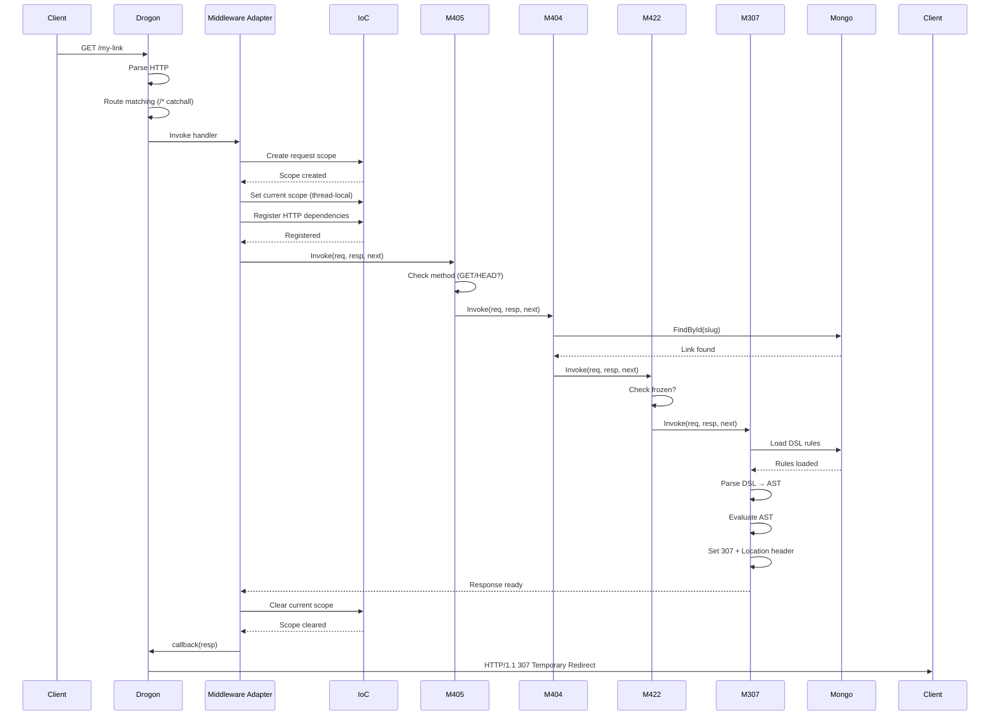

# Functional Process: HTTP Request Lifecycle

**Process ID:** `http_lifecycle`
**Type:** Functional/Technical Process
**Version:** 1.0.0
**Date:** 2026-03-16

---

## 📋 Описание

Полный жизненный цикл HTTP запроса в SmartLinks от получения запроса Drogon фреймворком до отправки ответа клиенту.

**Входные данные:**
- HTTP Request: `GET /my-link HTTP/1.1`
- Headers: `Accept-Language`, `Authorization`, etc.

**Выходные данные:**
- HTTP Response: `307 Temporary Redirect` с заголовком `Location`
- Или ошибка: `404`, `405`, `422`, `429`, `500`

---

## 🔄 Диаграмма процесса


---

## 📝 Детальный процесс

### Этап 1: Drogon Framework

**Код регистрации:**

```cpp
// src/main.cpp
int main() {
    // ... IoC setup ...

    // Зарегистрировать catch-all маршрут
    drogon::app().registerHandler(
        "/*",  // Все пути
        [&](const drogon::HttpRequestPtr& req,
            std::function<void(const drogon::HttpResponsePtr&)>&& callback) {

            // Получить middleware adapter из IoC
            auto adapter = ioc::IoC::Resolve<std::shared_ptr<IMiddleware>>(
                "DrogonMiddlewareAdapter"
            );

            // Создать response объект
            auto resp = drogon::HttpResponse::newHttpResponse();

            // Вызвать адаптер
            adapter->Invoke(req, resp, nullptr);  // next = nullptr (конец chain)

            // Отправить ответ
            callback(resp);
        },
        {drogon::Get, drogon::Head}  // Только GET и HEAD
    );

    // Запустить сервер
    drogon::app().addListener("0.0.0.0", 8080);
    drogon::app().run();
}
```

**Drogon обрабатывает:**
- TCP соединение
- HTTP парсинг (headers, body)
- Routing (/* catchall route)
- Создание HttpRequest объекта

---

### Этап 2: Middleware Adapter

**Назначение:** Мост между Drogon и нашей middleware pipeline.

**Код:**

```cpp
// src/middleware/drogon_middleware_adapter.cpp
void DrogonMiddlewareAdapter::Invoke(
    const drogon::HttpRequestPtr& req,
    drogon::HttpResponsePtr& resp,
    std::shared_ptr<IMiddleware> next
) {
    try {
        // 1. Создать request scope
        auto request_scope = ioc::IoC::Resolve<std::shared_ptr<ioc::IScopeDict>>(
            "IoC.Scope.Create"
        );

        // 2. Установить как текущий (thread-local)
        ioc::IoC::Resolve<std::shared_ptr<ioc::ICommand>>(
            "IoC.Scope.Current.Set",
            ioc::Args{request_scope}
        )->Execute();

        // 3. Зарегистрировать HTTP-зависимости
        RegisterHttpDependencies(req, resp);

        // 4. Получить middleware pipeline
        auto pipeline = GetMiddlewarePipeline();

        // 5. Запустить pipeline
        pipeline->Invoke(req, resp, nullptr);

    } catch (const std::exception& e) {
        LOG_ERROR << "Unhandled exception: " << e.what();
        resp->setStatusCode(drogon::k500InternalServerError);
        resp->setBody("Internal Server Error");
    }

    // 6. КРИТИЧНО: Очистить current scope
    ioc::IoC::Resolve<std::shared_ptr<ioc::ICommand>>(
        "IoC.Scope.Current.Set",
        ioc::Args{nullptr}
    )->Execute();
}
```

---

### Этап 3: Request Scope Creation

**Зачем:**
- Изоляция зависимостей между запросами
- Thread-local storage для request-specific данных
- Автоматическая очистка после завершения запроса

**Регистрация HTTP-зависимостей:**

```cpp
void RegisterHttpDependencies(
    const drogon::HttpRequestPtr& req,
    drogon::HttpResponsePtr& resp
) {
    // IHttpRequest - адаптер для доступа к Drogon request
    ioc::IoC::Resolve<std::shared_ptr<ioc::ICommand>>(
        "IoC.Register",
        ioc::Args{
            "IHttpRequest",
            ioc::DependencyFactory([req](const ioc::Args&) -> std::any {
                return std::make_shared<DrogonHttpRequest>(req);
            })
        }
    )->Execute();

    // IHttpResponse - адаптер для Drogon response
    ioc::IoC::Resolve<std::shared_ptr<ioc::ICommand>>(
        "IoC.Register",
        ioc::Args{
            "IHttpResponse",
            ioc::DependencyFactory([resp](const ioc::Args&) -> std::any {
                return std::make_shared<DrogonHttpResponse>(resp);
            })
        }
    )->Execute();

    // IContext - контекст для DSL evaluation
    ioc::IoC::Resolve<std::shared_ptr<ioc::ICommand>>(
        "IoC.Register",
        ioc::Args{
            "IContext",
            ioc::DependencyFactory([req](const ioc::Args&) -> std::any {
                auto context = std::make_shared<DslContext>();
                context->SetRequest(req);
                context->SetCurrentTime(std::time(nullptr));
                return context;
            })
        }
    )->Execute();
}
```

---

### Этап 4: Middleware Pipeline

**Получение pipeline:**

```cpp
std::shared_ptr<IMiddleware> GetMiddlewarePipeline() {
    // Chain: M405 -> M404 -> M422 -> M307
    auto m307 = ioc::IoC::Resolve<std::shared_ptr<IMiddleware>>(
        "TemporaryRedirectMiddleware"
    );

    auto m422 = ioc::IoC::Resolve<std::shared_ptr<IMiddleware>>(
        "UnprocessableContentMiddleware"
    );
    m422->SetNext(m307);

    auto m404 = ioc::IoC::Resolve<std::shared_ptr<IMiddleware>>(
        "NotFoundMiddleware"
    );
    m404->SetNext(m422);

    auto m405 = ioc::IoC::Resolve<std::shared_ptr<IMiddleware>>(
        "MethodNotAllowedMiddleware"
    );
    m405->SetNext(m404);

    return m405;  // Вернуть голову цепочки
}
```

**Выполнение:**

```cpp
// Каждый middleware:
void SomeMiddleware::Invoke(
    const HttpRequestPtr& req,
    HttpResponsePtr& resp,
    std::shared_ptr<IMiddleware> next
) {
    // 1. Проверить условие
    if (!ShouldProcess(req)) {
        // Установить ошибку и остановить pipeline
        resp->setStatusCode(kSomeError);
        return;
    }

    // 2. Передать следующему middleware
    if (next) {
        next->Invoke(req, resp, nullptr);
    }
}
```

**Подробнее:** См. [FUNCTIONAL_PROCESSES_middleware_pipeline.md](./FUNCTIONAL_PROCESSES_middleware_pipeline.md)

---

### Этап 5: Response Sending

**Drogon callback:**

```cpp
// main.cpp (в handler)
drogon::app().registerHandler(
    "/*",
    [&](const HttpRequestPtr& req,
        std::function<void(const HttpResponsePtr&)>&& callback) {

        auto resp = HttpResponse::newHttpResponse();

        // ... middleware processing ...

        // Отправить ответ клиенту
        callback(resp);  // Drogon сериализует и отправляет
    }
);
```

**Что происходит в callback:**
1. Сериализация HTTP ответа (status line, headers, body)
2. Отправка через TCP socket
3. Логирование (access log)
4. Keepalive или закрытие соединения

---

### Этап 6: Cleanup

**КРИТИЧНО:**

```cpp
// ВСЕГДА очищать current scope
ioc::IoC::Resolve<std::shared_ptr<ioc::ICommand>>(
    "IoC.Scope.Current.Set",
    ioc::Args{nullptr}
)->Execute();
```

**Почему:**
- Thread-local storage не очищается автоматически
- Утечка памяти если не очистить scope
- Следующий запрос в том же потоке получит старый scope

---

## ⏱️ Временные характеристики

| Этап | Время | Доля |
|------|-------|------|
| 1. Drogon parsing + routing | 0.1-0.2 ms | 5% |
| 2. Create request scope | 0.05 ms | 2% |
| 3. Register HTTP deps | 0.1 ms | 4% |
| 4. Middleware pipeline | 2-8 ms | 80% |
| 4a. - MongoDB query | 1-5 ms | 50% |
| 4b. - DSL parsing | 0.5-2 ms | 20% |
| 4c. - JWT validation | 0.5-2 ms | 10% |
| 5. Response sending | 0.1-0.2 ms | 5% |
| 6. Cleanup | 0.01 ms | <1% |
| **ИТОГО** | **2.5-10 ms** | **100%** |

**Bottleneck:** MongoDB query (1-5 ms)

---

## 🧵 Thread Model

### Drogon Thread Pool

**Конфигурация:**

```json
// config/config.json
{
  "app": {
    "threads_num": 4  // 4 worker threads
  }
}
```

**Поток запроса:**

```
TCP accept thread
  │
  └─> Parse HTTP
       │
       └─> Dispatch to worker thread (round-robin)
            │
            └─> Execute handler
                 │
                 ├─> Create request scope (thread-local)
                 ├─> Middleware pipeline
                 └─> Send response
                      │
                      └─> Thread returns to pool
```

**Thread-local scopes:**

```
Thread 1: [Request A scope] → [Request D scope] → [Request G scope]
Thread 2: [Request B scope] → [Request E scope] → [Request H scope]
Thread 3: [Request C scope] → [Request F scope] → [Request I scope]
Thread 4: [...]
```

---

## 🔒 Thread Safety

### Проблемы

**1. Root Scope Mutex:**

```cpp
// ALL threads compete for this mutex
std::mutex root_scope_mutex_;

// При 1000 RPS / 4 threads = ~250 lock/unlock per thread per second
// Потенциальный bottleneck!
```

**2. MongoDB Connection Pool:**

```cpp
// mongocxx driver использует connection pool
// Потоки блокируются, ожидая свободное соединение
```

**3. Thread-local Storage:**

```cpp
thread_local std::shared_ptr<IScopeDict> current_scope_;

// КРИТИЧНО: Должен быть nullptr между запросами!
// Иначе утечка памяти и некорректное поведение
```

---

## 🐛 Обработка исключений

### Try-Catch в Adapter

```cpp
try {
    // Middleware pipeline
    pipeline->Invoke(req, resp, nullptr);
} catch (const std::exception& e) {
    // Любое исключение = 500 Internal Error
    LOG_ERROR << "Unhandled exception: " << e.what();
    resp->setStatusCode(500);
    resp->setBody("Internal Server Error");
} catch (...) {
    LOG_ERROR << "Unknown exception";
    resp->setStatusCode(500);
    resp->setBody("Internal Server Error");
}

// ВСЕГДА выполнить cleanup
ioc::IoC::Resolve<std::shared_ptr<ioc::ICommand>>(
    "IoC.Scope.Current.Set",
    ioc::Args{nullptr}
)->Execute();
```

**Важно:**
- Исключения НЕ прерывают cleanup
- Cleanup выполняется ВСЕГДА (RAII было бы лучше)

---

## 📊 Sequence Diagram



---

## 🧪 Пример

### Запрос

```http
GET /summer-sale HTTP/1.1
Host: example.com
Accept-Language: ru-RU,ru;q=0.9
```

### Обработка

**1. Drogon:**
- Принять TCP соединение
- Распарсить HTTP (метод, путь, заголовки)
- Найти handler для `/*`

**2. Adapter:**
- Создать request scope
- Зарегистрировать `IHttpRequest`, `IHttpResponse`, `IContext`

**3. M405:**
- Метод = GET ✅
- Передать M404

**4. M404:**
- MongoDB: `db.links.findOne({ slug: "/summer-sale" })`
- Найден, state = "active" ✅
- Передать M422

**5. M422:**
- `link.is_frozen == false` ✅
- Передать M307

**6. M307:**
- MongoDB: загрузить `rules_dsl`
- Парсить DSL → AST
- Evaluate: `LANGUAGE = ru-RU → https://example.ru/sale` ✅
- Установить: `307 Temporary Redirect`, `Location: https://example.ru/sale`

**7. Cleanup:**
- Очистить current scope

**8. Response:**

```http
HTTP/1.1 307 Temporary Redirect
Location: https://example.ru/sale
Date: Sun, 16 Mar 2026 12:00:00 GMT
Server: Drogon/1.8.0
Content-Length: 0
```

---

## 🔗 Связанные процессы

- [FUNCTIONAL_PROCESSES_ioc_resolution.md](./FUNCTIONAL_PROCESSES_ioc_resolution.md) - IoC Container Resolution
- [FUNCTIONAL_PROCESSES_middleware_pipeline.md](./FUNCTIONAL_PROCESSES_middleware_pipeline.md) - Middleware Pipeline
- [FUNCTIONAL_PROCESSES_dsl_parsing.md](./FUNCTIONAL_PROCESSES_dsl_parsing.md) - DSL Parsing

---

## 📚 Файлы кода

| Файл | Описание |
|------|----------|
| `src/main.cpp` | Entry point, Drogon app setup, route registration |
| `src/middleware/drogon_middleware_adapter.cpp` | Мост между Drogon и middleware pipeline |
| `include/middleware/drogon_http_request.hpp` | Адаптер IHttpRequest для Drogon |
| `include/middleware/drogon_http_response.hpp` | Адаптер IHttpResponse для Drogon |
| `src/middleware/method_not_allowed_middleware.cpp` | M405 |
| `src/middleware/not_found_middleware.cpp` | M404 |
| `src/middleware/unprocessable_content_middleware.cpp` | M422 |
| `src/middleware/temporary_redirect_middleware.cpp` | M307 |

---

**Версия:** 1.0.0
**Дата:** 2026-03-16
