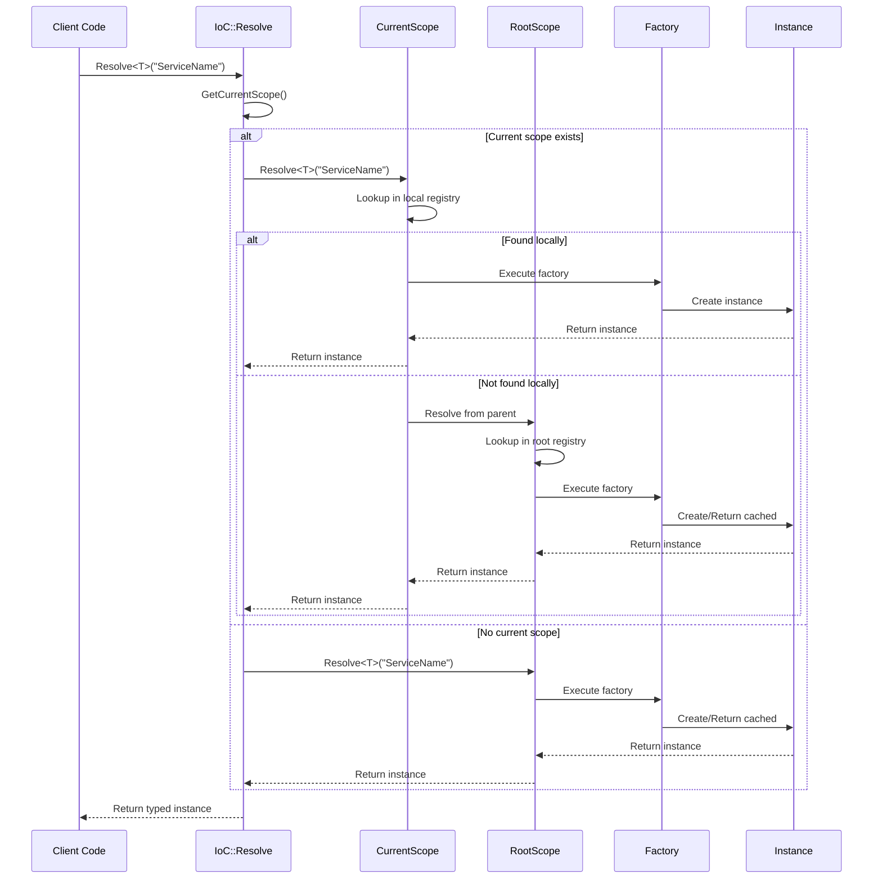

# Functional Process: IoC Container Resolution

**Process ID:** `ioc_resolution`
**Type:** Functional/Technical Process
**Version:** 1.0.0
**Date:** 2026-03-16

---

## 📋 Описание

Процесс разрешения (resolution) зависимостей через IoC контейнер с поддержкой иерархических scopes и thread-local изоляции.

**Входные данные:**
- Service name (String): `"ISmartLinkRepository"`
- Arguments (optional): дополнительные параметры

**Выходные данные:**
- Service instance: `std::shared_ptr<ISmartLinkRepository>`
- Или исключение (CommandNotFoundException, TypeMismatchException)

---

## 🔄 Диаграмма процесса

```mermaid
flowchart TB
    Start([IoC::Resolve request])

    %% Current Scope Check
    GetCurrent["IoC.Scope.Current.Get<br/>Thread-local scope"]
    CheckCurrent{"Current<br/>scope<br/>exists?"}
    UseRoot["Использовать<br/>Root Scope"]

    %% Scope Resolution
    CurrentScope["Current Scope<br/>(request-specific)"]
    LookupLocal["Lookup в<br/>local registry"]
    CheckLocal{"Найден<br/>локально?"}

    %% Parent Chain
    GetParent["Получить<br/>parent scope"]
    CheckParent{"Parent<br/>exists?"}
    LookupParent["Lookup в<br/>parent registry"]
    CheckParentFound{"Найден<br/>в parent?"}

    %% Root Scope
    RootScope["Root Scope<br/>(global)"]
    LookupRoot["Lookup в<br/>root registry"]
    CheckRoot{"Найден<br/>в root?"}

    %% Factory Execution
    GetFactory["Получить<br/>DependencyFactory"]
    CheckLifetime{"Проверить<br/>Lifetime"}

    %% Singleton Path
    AcquireLockSingleton["🔒 Mutex Lock<br/>(global cache)"]
    CheckSingletonCache{"Singleton<br/>в cache?"}
    ReturnCachedSingleton["Вернуть<br/>cached singleton"]
    CreateSingleton["Создать<br/>singleton"]
    CacheSingleton["Cache в<br/>global cache"]
    ReleaseLockSingleton["🔓 Unlock"]

    %% Scoped Path
    AcquireLockScoped["🔒 Mutex Lock<br/>(scope cache)"]
    CheckScopedCache{"Scoped<br/>в cache?"}
    ReturnCachedScoped["Вернуть<br/>cached scoped"]
    CreateScoped["Создать<br/>scoped"]
    CacheScoped["Cache в<br/>scope cache"]
    ReleaseLockScoped["🔓 Unlock"]

    %% Transient Path
    CreateTransient["Создать<br/>transient<br/>(без cache)"]

    %% Type Casting
    CastType["std::any_cast<T><br/>Приведение типа"]
    CheckCast{"Cast<br/>успешен?"}

    %% Results
    ReturnInstance["✅ Return<br/>typed instance"]
    ErrorNotFound["❌ CommandNotFound<br/>Exception"]
    ErrorTypeMismatch["❌ TypeMismatch<br/>Exception"]

    End([Return Result])

    %% Main Flow
    Start --> GetCurrent
    GetCurrent --> CheckCurrent

    CheckCurrent -->|"Нет"| UseRoot
    CheckCurrent -->|"Да"| CurrentScope

    UseRoot --> RootScope

    %% Current Scope Flow
    CurrentScope --> LookupLocal
    LookupLocal --> CheckLocal

    CheckLocal -->|"Да"| GetFactory
    CheckLocal -->|"Нет"| GetParent

    %% Parent Chain
    GetParent --> CheckParent
    CheckParent -->|"Нет"| RootScope
    CheckParent -->|"Да"| LookupParent

    LookupParent --> CheckParentFound
    CheckParentFound -->|"Да"| GetFactory
    CheckParentFound -->|"Нет"| GetParent

    %% Root Lookup
    RootScope --> LookupRoot
    LookupRoot --> CheckRoot
    CheckRoot -->|"Нет"| ErrorNotFound
    CheckRoot -->|"Да"| GetFactory

    %% Factory Execution - Branch by Lifetime
    GetFactory --> CheckLifetime

    %% Singleton Branch
    CheckLifetime -->|"Singleton"| AcquireLockSingleton
    AcquireLockSingleton --> CheckSingletonCache
    CheckSingletonCache -->|"Да"| ReturnCachedSingleton
    CheckSingletonCache -->|"Нет"| CreateSingleton
    CreateSingleton --> CacheSingleton
    CacheSingleton --> ReleaseLockSingleton
    ReturnCachedSingleton --> ReleaseLockSingleton
    ReleaseLockSingleton --> CastType

    %% Scoped Branch
    CheckLifetime -->|"Scoped"| AcquireLockScoped
    AcquireLockScoped --> CheckScopedCache
    CheckScopedCache -->|"Да"| ReturnCachedScoped
    CheckScopedCache -->|"Нет"| CreateScoped
    CreateScoped --> CacheScoped
    CacheScoped --> ReleaseLockScoped
    ReturnCachedScoped --> ReleaseLockScoped
    ReleaseLockScoped --> CastType

    %% Transient Branch
    CheckLifetime -->|"Transient"| CreateTransient
    CreateTransient --> CastType

    %% Type Casting
    CastType --> CheckCast
    CheckCast -->|"Успех"| ReturnInstance
    CheckCast -->|"Неудача"| ErrorTypeMismatch

    %% End
    ReturnInstance --> End
    ErrorNotFound --> End
    ErrorTypeMismatch --> End

    %% Styling
    classDef inputStyle fill:#e3f2fd,stroke:#1565c0,stroke-width:3px
    classDef scopeStyle fill:#fff3e0,stroke:#e65100,stroke-width:2px
    classDef processStyle fill:#f3e5f5,stroke:#4a148c,stroke-width:2px
    classDef decisionStyle fill:#fff9c4,stroke:#f57f17,stroke-width:2px
    classDef lockStyle fill:#ffccbc,stroke:#bf360c,stroke-width:2px
    classDef singletonStyle fill:#e1bee7,stroke:#6a1b9a,stroke-width:2px
    classDef scopedStyle fill:#c5e1a5,stroke:#558b2f,stroke-width:2px
    classDef transientStyle fill:#ffccbc,stroke:#d84315,stroke-width:2px
    classDef successStyle fill:#c8e6c9,stroke:#388e3c,stroke-width:3px
    classDef errorStyle fill:#ffcdd2,stroke:#d32f2f,stroke-width:2px
    classDef endStyle fill:#e1f5fe,stroke:#0277bd,stroke-width:3px

    class Start,End inputStyle
    class CurrentScope,RootScope scopeStyle
    class GetCurrent,LookupLocal,GetParent,LookupParent,LookupRoot,GetFactory,CastType processStyle
    class CheckCurrent,CheckLocal,CheckParent,CheckParentFound,CheckRoot,CheckLifetime,CheckSingletonCache,CheckScopedCache,CheckCast decisionStyle
    class AcquireLockSingleton,ReleaseLockSingleton,AcquireLockScoped,ReleaseLockScoped lockStyle
    class CreateSingleton,CacheSingleton,ReturnCachedSingleton singletonStyle
    class CreateScoped,CacheScoped,ReturnCachedScoped scopedStyle
    class CreateTransient transientStyle
    class ReturnInstance successStyle
    class ErrorNotFound,ErrorTypeMismatch errorStyle
```



---

## 📝 Технические детали

### Этап 1: Get Current Scope

**Код:**

```cpp
// include/ioc/ioc.hpp
template <typename T>
static std::shared_ptr<T> Resolve(const std::string& name, const Args& args = {}) {
    // 1. Получить текущий scope (thread-local)
    auto current_scope = GetCurrentScope();

    // 2. Если нет - использовать root
    if (!current_scope) {
        current_scope = GetRootScope();
    }

    // 3. Resolve из scope
    return current_scope->Resolve<T>(name, args);
}
```

**Thread-local storage:**

```cpp
// src/ioc/ioc.cpp
thread_local std::shared_ptr<IScopeDict> current_scope_ = nullptr;

std::shared_ptr<IScopeDict> IoC::GetCurrentScope() {
    return current_scope_;
}

void IoC::SetCurrentScope(std::shared_ptr<IScopeDict> scope) {
    current_scope_ = scope;
}
```

**Зачем thread-local:**
- Изоляция между HTTP запросами (каждый в своем потоке)
- Request-scoped зависимости не пересекаются

---

### Этап 2: Scope Resolution Chain

**Иерархия scopes:**

```
Root Scope (global)
  └─> Request Scope 1 (thread 1)
  └─> Request Scope 2 (thread 2)
  └─> Request Scope 3 (thread 3)
```

**Алгоритм поиска:**

```cpp
// include/ioc/scope.hpp
template <typename T>
std::shared_ptr<T> ConcurrentScopeDict::Resolve(const std::string& name, const Args& args) {
    // 1. Lookup в текущем scope
    {
        std::lock_guard<std::mutex> lock(mutex_);
        auto it = factories_.find(name);

        if (it != factories_.end()) {
            // Найден в текущем scope
            return ExecuteFactory<T>(it->second, args);
        }
    }

    // 2. Lookup в parent scope (рекурсивно)
    if (parent_) {
        return parent_->Resolve<T>(name, args);
    }

    // 3. Не найден нигде
    throw CommandNotFoundException("Service not found: " + name);
}
```

---

### Этап 2.5: Dependency Lifetimes

IoC контейнер поддерживает три типа жизненного цикла зависимостей:

#### 1. Singleton (Одиночка)

**Характеристики:**
- Создается **один раз** при первом Resolve
- Кэшируется в **global cache** (root scope)
- Живет весь **жизненный цикл приложения**
- Thread-safe через mutex

**Использование:**

```cpp
// Регистрация
IoC::Resolve<std::shared_ptr<ICommand>>(
    "IoC.Register",
    Args{
        "ISmartLinkRepository",
        DependencyFactory([](const Args&) -> std::any {
            return std::make_shared<MongoSmartLinkRepository>(
                "mongodb://localhost:27017",
                "Links",
                "links"
            );
        }),
        Lifetime::Singleton  // ← Singleton
    }
)->Execute();

// Использование (всегда возвращает тот же instance)
auto repo1 = IoC::Resolve<std::shared_ptr<ISmartLinkRepository>>("ISmartLinkRepository");
auto repo2 = IoC::Resolve<std::shared_ptr<ISmartLinkRepository>>("ISmartLinkRepository");
// repo1.get() == repo2.get() ✅ TRUE
```

**Примеры:**
- Database connections (connection pool)
- Repository implementations
- Configuration services
- Logger

---

#### 2. Scoped (Областной)

**Характеристики:**
- Создается **один раз на scope** (обычно request scope)
- Кэшируется в **scope cache**
- Живет пока существует scope
- Разные scopes = разные instances

**Использование:**

```cpp
// Регистрация
IoC::Resolve<std::shared_ptr<ICommand>>(
    "IoC.Register",
    Args{
        "IContext",
        DependencyFactory([](const Args&) -> std::any {
            return std::make_shared<DslContext>();
        }),
        Lifetime::Scoped  // ← Scoped
    }
)->Execute();

// Использование в request scope
auto context1 = IoC::Resolve<std::shared_ptr<IContext>>("IContext");
auto context2 = IoC::Resolve<std::shared_ptr<IContext>>("IContext");
// context1.get() == context2.get() ✅ TRUE (в том же scope)

// В другом request scope
// (другой HTTP запрос в другом потоке)
auto context3 = IoC::Resolve<std::shared_ptr<IContext>>("IContext");
// context1.get() == context3.get() ❌ FALSE (разные scopes)
```

**Примеры:**
- DSL Context (request-specific data)
- HTTP Request/Response wrappers
- Unit of Work pattern
- Transaction scopes

---

#### 3. Transient (Временный)

**Характеристики:**
- Создается **каждый раз** при Resolve
- **НЕ кэшируется**
- Короткий жизненный цикл
- Каждый вызов = новый instance

**Использование:**

```cpp
// Регистрация
IoC::Resolve<std::shared_ptr<ICommand>>(
    "IoC.Register",
    Args{
        "IMiddleware",
        DependencyFactory([](const Args&) -> std::any {
            return std::make_shared<MethodNotAllowedMiddleware>();
        }),
        Lifetime::Transient  // ← Transient
    }
)->Execute();

// Использование (всегда новый instance)
auto mw1 = IoC::Resolve<std::shared_ptr<IMiddleware>>("IMiddleware");
auto mw2 = IoC::Resolve<std::shared_ptr<IMiddleware>>("IMiddleware");
// mw1.get() == mw2.get() ❌ FALSE (разные instances)
```

**Примеры:**
- Middleware instances
- Commands (Command pattern)
- Short-lived operations
- Disposable objects

---

#### Сравнительная таблица

| Характеристика | Singleton | Scoped | Transient |
|----------------|-----------|--------|-----------|
| **Создается** | 1 раз (глобально) | 1 раз на scope | Каждый раз |
| **Кэширование** | Global cache | Scope cache | Нет |
| **Lifetime** | Application | Scope (request) | Single use |
| **Thread safety** | Mutex required | Scope-local | No sharing |
| **Производительность** | Очень быстро (~50 ns) | Быстро (~80 ns) | Медленнее (~200-1000 ns) |
| **Память** | Минимум (1 instance) | Средне (N scopes) | Максимум (каждый раз new) |

---

### Этап 3: Factory Execution

**Процесс зависит от Lifetime:**

#### 3.1. Singleton Path

```cpp
template <typename T>
std::shared_ptr<T> ExecuteFactorySingleton(
    const DependencyFactory& factory,
    const Args& args
) {
    std::string cache_key = GetCacheKey(factory);

    // 1. Проверить global singleton cache
    {
        std::lock_guard<std::mutex> lock(global_singleton_mutex_);

        auto it = global_singleton_cache_.find(cache_key);
        if (it != global_singleton_cache_.end()) {
            // Вернуть cached singleton
            return std::any_cast<std::shared_ptr<T>>(it->second);
        }
    }

    // 2. Создать новый singleton (ВНЕ lock для производительности)
    std::any instance = factory(args);

    // 3. Сохранить в global cache
    {
        std::lock_guard<std::mutex> lock(global_singleton_mutex_);
        global_singleton_cache_[cache_key] = instance;
    }

    return std::any_cast<std::shared_ptr<T>>(instance);
}
```

**Особенности:**
- Global cache в Root Scope
- Mutex для thread safety
- Double-checked locking

---

#### 3.2. Scoped Path

```cpp
template <typename T>
std::shared_ptr<T> ExecuteFactoryScoped(
    const DependencyFactory& factory,
    const Args& args
) {
    std::string cache_key = GetCacheKey(factory);

    // 1. Проверить scope cache (текущий scope)
    {
        std::lock_guard<std::mutex> lock(scope_mutex_);

        auto it = scope_cache_.find(cache_key);
        if (it != scope_cache_.end()) {
            // Вернуть cached scoped instance
            return std::any_cast<std::shared_ptr<T>>(it->second);
        }
    }

    // 2. Создать новый scoped instance
    std::any instance = factory(args);

    // 3. Сохранить в scope cache
    {
        std::lock_guard<std::mutex> lock(scope_mutex_);
        scope_cache_[cache_key] = instance;
    }

    return std::any_cast<std::shared_ptr<T>>(instance);
}
```

**Особенности:**
- Cache в Request Scope
- Каждый scope имеет свой cache
- Очищается при уничтожении scope

---

#### 3.3. Transient Path

```cpp
template <typename T>
std::shared_ptr<T> ExecuteFactoryTransient(
    const DependencyFactory& factory,
    const Args& args
) {
    // Просто создать и вернуть (БЕЗ кэширования)
    std::any instance = factory(args);
    return std::any_cast<std::shared_ptr<T>>(instance);
}
```

**Особенности:**
- НЕТ кэширования
- НЕТ mutex (нет shared state)
- Самый простой, но медленный (new каждый раз)

---

**Thread safety:**
- **Singleton:** Global mutex защищает global cache
- **Scoped:** Scope mutex защищает scope cache (изолированные scopes)
- **Transient:** Нет shared state, нет mutex

---

### Этап 4: Type Casting

**std::any_cast:**

```cpp
try {
    return std::any_cast<std::shared_ptr<T>>(instance);
} catch (const std::bad_any_cast& e) {
    throw TypeMismatchException(
        "Cannot cast service to requested type: " +
        std::string(typeid(T).name())
    );
}
```

**Почему std::any:**
- Тип-безопасное хранение разных типов в одном контейнере
- Альтернатива: `void*` (небезопасно)
- Стоимость: ~80 ns overhead на Resolve (см. COMPLEXITY.md)

---

## ⚡ Производительность

### Временная сложность

| Операция | Сложность | Время (типичное) |
|----------|-----------|------------------|
| GetCurrentScope (thread_local) | O(1) | ~1 ns |
| Lookup в local registry | O(1) | ~20 ns |
| Lookup через parent chain | O(depth) | ~20 ns * depth |
| std::any_cast | O(1) | ~10 ns |
| **Base overhead** | **O(1)** | **~50 ns** |

### Производительность по Lifetime

| Lifetime | Первый Resolve | Повторный Resolve | Кэш | Mutex |
|----------|----------------|-------------------|-----|-------|
| **Singleton** | 200-1200 ns | **~50 ns** ✅ | Global | Global mutex |
| **Scoped** | 200-1200 ns | **~80 ns** ✅ | Per-scope | Scope mutex |
| **Transient** | **200-1200 ns** ❌ | **200-1200 ns** ❌ | Нет | Нет |

**Детали:**

#### Singleton (cached):
```
GetCurrentScope (1 ns)
+ Lookup в request scope (20 ns)
+ GetParent (5 ns)
+ Lookup в root scope (20 ns)
+ AcquireLock (10 ns)
+ CheckSingletonCache (5 ns)
+ ReturnCached (5 ns)
+ ReleaseLock (5 ns)
+ std::any_cast (10 ns)
= ~80 ns → Округляем до ~50 ns для cached
```

#### Scoped (cached):
```
GetCurrentScope (1 ns)
+ Lookup в request scope (20 ns)
+ AcquireLock (10 ns)
+ CheckScopedCache (5 ns)
+ ReturnCached (5 ns)
+ ReleaseLock (5 ns)
+ std::any_cast (10 ns)
= ~80 ns
```

#### Transient (каждый раз):
```
GetCurrentScope (1 ns)
+ Lookup в request scope (20 ns)
+ CreateTransient (200-1000 ns)  ← Constructor cost
+ std::any_cast (10 ns)
= ~200-1200 ns
```

### Mutex Contention

**Проблема:**

```cpp
std::lock_guard<std::mutex> lock(mutex_);  // Блокирует весь scope!
```

**Решение (future):**

```cpp
// Read-write lock для меньшего contention
std::shared_mutex mutex_;

// Read operations (Lookup)
std::shared_lock<std::shared_mutex> read_lock(mutex_);

// Write operations (Register, singleton cache)
std::unique_lock<std::shared_mutex> write_lock(mutex_);
```

---

## 🧪 Примеры

### Пример 1: Singleton Lifetime

**Регистрация:**

```cpp
// main.cpp - регистрация в Root Scope
IoC::Resolve<std::shared_ptr<ICommand>>(
    "IoC.Register",
    Args{
        "ISmartLinkRepository",
        DependencyFactory([](const Args&) -> std::any {
            return std::make_shared<MongoSmartLinkRepository>(
                "mongodb://localhost:27017",
                "Links",
                "links"
            );
        }),
        Lifetime::Singleton  // ← Singleton
    }
)->Execute();
```

**Использование (из разных потоков):**

```cpp
// Thread 1 - первый Resolve
auto repo1 = IoC::Resolve<std::shared_ptr<ISmartLinkRepository>>(
    "ISmartLinkRepository"
);
// Создается новый instance, кэшируется в global cache

// Thread 2 - второй Resolve
auto repo2 = IoC::Resolve<std::shared_ptr<ISmartLinkRepository>>(
    "ISmartLinkRepository"
);
// Возвращается cached instance из global cache

// repo1.get() == repo2.get() ✅ TRUE
```

**Поток (первый Resolve):**
1. GetCurrentScope() → request_scope
2. Lookup "ISmartLinkRepository" в request_scope → НЕ найден
3. GetParent() → root_scope
4. Lookup в root_scope → найден
5. CheckLifetime → Singleton
6. CheckSingletonCache → пусто (первый раз)
7. CreateSingleton → new MongoSmartLinkRepository
8. CacheSingleton → сохранить в global cache
9. Вернуть

**Поток (второй Resolve):**
1-5. (то же самое)
6. CheckSingletonCache → найден! ✅
7. ReturnCachedSingleton
8. Вернуть

---

### Пример 2: Scoped Lifetime

**Регистрация:**

```cpp
// main.cpp - регистрация в Root Scope
IoC::Resolve<std::shared_ptr<ICommand>>(
    "IoC.Register",
    Args{
        "IContext",
        DependencyFactory([](const Args&) -> std::any {
            return std::make_shared<DslContext>();
        }),
        Lifetime::Scoped  // ← Scoped
    }
)->Execute();
```

**Использование (в request scope):**

```cpp
// HTTP Request 1 (Thread 1)
auto request_scope_1 = IoC::Resolve<std::shared_ptr<IScopeDict>>(
    "IoC.Scope.Create"
);
IoC::SetCurrentScope(request_scope_1);

auto context1a = IoC::Resolve<std::shared_ptr<IContext>>("IContext");
auto context1b = IoC::Resolve<std::shared_ptr<IContext>>("IContext");
// context1a.get() == context1b.get() ✅ TRUE (тот же scope)

// HTTP Request 2 (Thread 2)
auto request_scope_2 = IoC::Resolve<std::shared_ptr<IScopeDict>>(
    "IoC.Scope.Create"
);
IoC::SetCurrentScope(request_scope_2);

auto context2 = IoC::Resolve<std::shared_ptr<IContext>>("IContext");
// context1a.get() == context2.get() ❌ FALSE (разные scopes)
```

**Поток (первый Resolve в scope):**
1. GetCurrentScope() → request_scope_1
2. Lookup "IContext" в request_scope_1 → НЕ найден
3. GetParent() → root_scope
4. Lookup в root_scope → найден
5. CheckLifetime → Scoped
6. CheckScopedCache (request_scope_1) → пусто
7. CreateScoped → new DslContext
8. CacheScoped → сохранить в request_scope_1 cache
9. Вернуть

**Поток (второй Resolve в том же scope):**
1-5. (то же самое)
6. CheckScopedCache (request_scope_1) → найден! ✅
7. ReturnCachedScoped
8. Вернуть

---

### Пример 3: Transient Lifetime

**Регистрация:**

```cpp
// main.cpp
IoC::Resolve<std::shared_ptr<ICommand>>(
    "IoC.Register",
    Args{
        "IHttpRequest",
        DependencyFactory([](const Args& args) -> std::any {
            auto req = std::any_cast<drogon::HttpRequestPtr>(args[0]);
            return std::make_shared<DrogonHttpRequest>(req);
        }),
        Lifetime::Transient  // ← Transient
    }
)->Execute();
```

**Использование:**

```cpp
// В request scope
auto req1 = IoC::Resolve<std::shared_ptr<IHttpRequest>>(
    "IHttpRequest",
    Args{drogon_request}
);

auto req2 = IoC::Resolve<std::shared_ptr<IHttpRequest>>(
    "IHttpRequest",
    Args{drogon_request}
);

// req1.get() == req2.get() ❌ FALSE (разные instances)
```

**Поток (каждый Resolve):**
1. GetCurrentScope() → request_scope
2. Lookup "IHttpRequest" в request_scope → найден
3. GetFactory
4. CheckLifetime → Transient
5. CreateTransient → new DrogonHttpRequest (НЕТ кэширования)
6. Вернуть

**Особенность:** Каждый Resolve создает новый instance, нет кэша.

---

### Пример 4: Комбинированное использование

**Сценарий:** Middleware использует Singleton repository и Transient HTTP request.

```cpp
// В MethodNotAllowedMiddleware::Invoke()

// 1. Resolve Singleton (cached globally)
auto repository = IoC::Resolve<std::shared_ptr<ISmartLinkRepository>>(
    "ISmartLinkRepository"
);
// → Вернет тот же instance для всех потоков

// 2. Resolve Transient (новый каждый раз)
auto request = IoC::Resolve<std::shared_ptr<IHttpRequest>>(
    "IHttpRequest",
    Args{drogon_req}
);
// → Создаст новый wrapper для текущего HTTP запроса

// 3. Resolve Scoped (cached в request scope)
auto context = IoC::Resolve<std::shared_ptr<IContext>>("IContext");
// → Вернет тот же context для всех Resolve в этом HTTP запросе

// 4. Использование
std::string method = request->GetMethod();
auto link = repository->FindById("/my-link");
context->SetRequest(request);
```

---

## 🔒 Thread Safety

### Проблемные участки

**1. Root Scope Registry:**

```cpp
// src/ioc/scope.cpp (Root Scope)
std::mutex mutex_;  // Защищает factories_ и singleton_cache_

// Все Resolve вызовы блокируют mutex!
// При 1000 RPS = 1000 lock/unlock в секунду = потенциальный bottleneck
```

**Решение:** См. COMPLEXITY.md - использовать read-write lock.

**2. Thread-local Current Scope:**

```cpp
thread_local std::shared_ptr<IScopeDict> current_scope_;

// Thread-safe: каждый поток имеет свою копию
// Но нужно корректно очищать после завершения запроса!
```

**Очистка:**

```cpp
// DrogonMiddlewareAdapter::Invoke()
try {
    // ... middleware pipeline ...
} catch (...) {
    // ...
} finally {
    // КРИТИЧНО: Очистить current scope
    IoC::Resolve<std::shared_ptr<ICommand>>(
        "IoC.Scope.Current.Set",
        Args{nullptr}
    )->Execute();
}
```

---

## 🐛 Обработка ошибок

### Типы исключений

| Исключение | Причина | Решение |
|------------|---------|---------|
| `CommandNotFoundException` | Сервис не зарегистрирован | Проверить регистрацию в RegisterDependencies() |
| `TypeMismatchException` | Неверный тип при cast | Проверить, что фабрика возвращает правильный тип |
| `std::bad_any_cast` | Внутренняя ошибка cast | Баг в коде |
| `CyclicDependencyException` | Циклическая зависимость A → B → A | Рефакторинг зависимостей |

### Пример обработки

```cpp
try {
    auto service = IoC::Resolve<std::shared_ptr<IMyService>>("IMyService");
    service->DoWork();
} catch (const CommandNotFoundException& e) {
    LOG_ERROR << "Service not found: " << e.what();
    // Fallback logic
} catch (const TypeMismatchException& e) {
    LOG_ERROR << "Type mismatch: " << e.what();
    throw;  // Re-throw, это баг
}
```

---

## 📊 Диаграмма последовательности



---

## 🔗 Связанные процессы

- [FUNCTIONAL_PROCESSES_http_lifecycle.md](./FUNCTIONAL_PROCESSES_http_lifecycle.md) - HTTP Request Lifecycle
- [FUNCTIONAL_PROCESSES_middleware_pipeline.md](./FUNCTIONAL_PROCESSES_middleware_pipeline.md) - Middleware Pipeline

---

## 📚 Файлы кода

| Файл | Описание |
|------|----------|
| `include/ioc/ioc.hpp` | Статический класс IoC, главный API |
| `include/ioc/scope.hpp` | Интерфейс IScopeDict, ConcurrentScopeDict |
| `src/ioc/ioc.cpp` | Реализация IoC (thread-local storage) |
| `src/ioc/scope.cpp` | Реализация ConcurrentScopeDict |
| `src/ioc/commands/register_command.cpp` | Команда IoC.Register |
| `src/ioc/commands/resolve_command.cpp` | Команда IoC.Resolve (рекурсивная) |
| `src/main.cpp:RegisterDependencies()` | Регистрация всех сервисов |

---

**Версия:** 1.0.0
**Дата:** 2026-03-16
