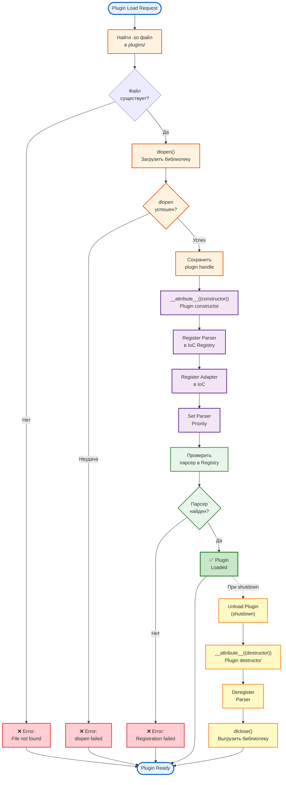

# Functional Process: Plugin Loading

**Process ID:** `plugin_loading`
**Type:** Functional/Technical Process
**Version:** 1.0.0
**Date:** 2026-03-16

---

## 📋 Описание

Процесс динамической загрузки DSL плагинов (shared libraries) с автоматической регистрацией парсеров и адаптеров в IoC контейнере.

**Входные данные:**
- Plugin path: `/app/plugins/libdatetime_plugin.so`

**Выходные данные:**
- Зарегистрированные парсеры в ParserRegistry
- Зарегистрированные адаптеры в IoC
- Plugin handle для выгрузки

---

## 🔄 Диаграмма процесса



---

## 📝 Технические детали

### Этап 1: Plugin Discovery

**Код:**

```cpp
// src/dsl/plugin_loader.cpp
void PluginLoader::LoadAllPlugins() {
    const std::string plugins_dir = "/app/plugins/";

    // Найти все .so файлы
    std::vector<std::string> plugin_files = {
        plugins_dir + "libdatetime_plugin.so",
        plugins_dir + "liblanguage_plugin.so",
        plugins_dir + "libauthorized_plugin.so"
    };

    for (const auto& plugin_path : plugin_files) {
        LoadPlugin(plugin_path);
    }
}
```

**Альтернатива (сканирование директории):**

```cpp
#include <filesystem>

namespace fs = std::filesystem;

void PluginLoader::LoadAllPlugins() {
    for (const auto& entry : fs::directory_iterator("/app/plugins/")) {
        if (entry.path().extension() == ".so") {
            LoadPlugin(entry.path().string());
        }
    }
}
```

---

### Этап 2: dlopen - Загрузка Shared Library

**Код:**

```cpp
void PluginLoader::LoadPlugin(const std::string& plugin_path) {
    // 1. Загрузить библиотеку
    void* handle = dlopen(plugin_path.c_str(), RTLD_NOW | RTLD_GLOBAL);

    if (!handle) {
        const char* error = dlerror();
        LOG_ERROR << "Failed to load plugin: " << plugin_path
                  << ", error: " << (error ? error : "unknown");
        throw std::runtime_error("Plugin load failed");
    }

    // 2. Сохранить handle для выгрузки
    plugin_handles_[plugin_path] = handle;

    LOG_INFO << "Plugin loaded: " << plugin_path;
}
```

**Флаги dlopen:**

| Флаг | Описание |
|------|----------|
| `RTLD_NOW` | Разрешить все символы сразу (fail fast) |
| `RTLD_LAZY` | Разрешить символы по мере использования |
| `RTLD_GLOBAL` | Символы доступны другим библиотекам |
| `RTLD_LOCAL` | Символы приватные (default) |

**Почему RTLD_NOW:**
- Обнаружение отсутствующих символов при загрузке, а не при использовании
- Fail fast - лучше для production

---

### Этап 3: Plugin Constructor

**Механизм:**

```cpp
// plugins/datetime/src/plugin_entry.cpp
__attribute__((constructor))
void DatetimePluginInit() {
    // Вызывается АВТОМАТИЧЕСКИ при dlopen()
    LOG_INFO << "Initializing Datetime Plugin...";

    // Регистрация парсера
    RegisterDatetimeParser();

    // Регистрация адаптера
    RegisterDatetimeAdapter();

    LOG_INFO << "Datetime Plugin initialized";
}
```

**Как работает `__attribute__((constructor))`:**

1. dlopen загружает .so файл в память
2. Динамический линковщик находит все функции с атрибутом `constructor`
3. Вызывает их ПЕРЕД возвратом из dlopen
4. Гарантированный порядок инициализации

**Альтернатива (manual):**

```cpp
// Без __attribute__((constructor))
void* handle = dlopen("plugin.so", RTLD_NOW);

// Вручную найти entry point
typedef void (*InitFunc)();
InitFunc init = (InitFunc)dlsym(handle, "PluginInit");

if (init) {
    init();  // Вызвать вручную
}
```

Но `__attribute__((constructor))` удобнее и безопаснее.

---

### Этап 4: Parser Registration

**Код:**

```cpp
// plugins/datetime/src/plugin_entry.cpp
void RegisterDatetimeParser() {
    // 1. Создать экземпляр парсера
    auto parser = std::make_shared<DatetimeParser>();

    // 2. Зарегистрировать в IoC как factory
    ioc::IoC::Resolve<std::shared_ptr<ioc::ICommand>>(
        "IoC.Register",
        ioc::Args{
            "DatetimeParser",
            ioc::DependencyFactory([parser](const ioc::Args&) -> std::any {
                return parser;
            })
        }
    )->Execute();

    // 3. Зарегистрировать в ParserRegistry с приоритетом
    auto registry = ioc::IoC::Resolve<std::shared_ptr<IParserRegistry>>(
        "ParserRegistry"
    );

    registry->RegisterParser(
        "DATETIME",         // Имя
        parser,             // Парсер
        100                 // Приоритет (higher = first)
    );

    LOG_INFO << "DatetimeParser registered with priority 100";
}
```

**Parser Priority:**

| Парсер | Приоритет | Зачем |
|--------|-----------|-------|
| DatetimeParser | 100 | Высокий (DATETIME может быть похож на другие выражения) |
| LanguageParser | 90 | Средний |
| AuthorizedParser | 80 | Низкий (простое выражение, всегда уникально) |

**Почему порядок важен:**

```
DSL: "DATETIME IN[2020-01-01, 2025-12-31]"

Iteration:
1. DatetimeParser (100) → TryParse() → SUCCESS ✅
   (Не проверяются остальные парсеры)
```

Если бы DatetimeParser был последним:
- Все предыдущие парсеры попробуют и провалятся
- Лишние CPU cycles

---

### Этап 5: Adapter Registration

**Код:**

```cpp
// plugins/datetime/src/plugin_entry.cpp
void RegisterDatetimeAdapter() {
    // Регистрация ITimePointAccessible интерфейса
    ioc::IoC::Resolve<std::shared_ptr<ioc::ICommand>>(
        "IoC.Register",
        ioc::Args{
            "Context2TimePoint",
            ioc::DependencyFactory([](const ioc::Args& args) -> std::any {
                // Получить context из args
                auto context = std::any_cast<std::shared_ptr<IContext>>(args.at(0));

                // Создать адаптер
                return std::make_shared<Context2TimePoint>(context);
            })
        }
    )->Execute();

    LOG_INFO << "Context2TimePoint adapter registered";
}
```

**Назначение адаптера:**

```cpp
// Адаптер позволяет AST узлам получать данные из контекста

// AST узел:
class DatetimeLessThanExpression : public IBoolExpression {
    bool Evaluate(const IContext& ctx) const override {
        // Получить адаптер
        auto adapter = ioc::IoC::Resolve<std::shared_ptr<ITimePointAccessible>>(
            "Context2TimePoint",
            ioc::Args{std::make_shared<IContext>(ctx)}
        );

        // Использовать
        time_t current_time = adapter->GetCurrentTime();
        return current_time < threshold_;
    }
};
```

---

### Этап 6: Verification

**Код:**

```cpp
void PluginLoader::VerifyPlugin(const std::string& parser_name) {
    auto registry = ioc::IoC::Resolve<std::shared_ptr<IParserRegistry>>(
        "ParserRegistry"
    );

    auto parsers = registry->GetAllParsers();

    bool found = false;
    for (const auto& parser : parsers) {
        if (parser->GetName() == parser_name) {
            found = true;
            LOG_INFO << "Verified: " << parser_name
                     << " (priority: " << parser->GetPriority() << ")";
            break;
        }
    }

    if (!found) {
        LOG_ERROR << "Plugin verification failed: " << parser_name;
        throw std::runtime_error("Parser not registered");
    }
}
```

---

### Этап 7: Plugin Unload (Shutdown)

**Код:**

```cpp
PluginLoader::~PluginLoader() {
    // При shutdown - выгрузить все плагины
    for (auto& [path, handle] : plugin_handles_) {
        UnloadPlugin(path, handle);
    }
}

void PluginLoader::UnloadPlugin(const std::string& path, void* handle) {
    LOG_INFO << "Unloading plugin: " << path;

    // dlclose вызовет __attribute__((destructor))
    if (dlclose(handle) != 0) {
        LOG_ERROR << "Failed to unload plugin: " << path
                  << ", error: " << dlerror();
    }
}
```

**Plugin Destructor:**

```cpp
// plugins/datetime/src/plugin_entry.cpp
__attribute__((destructor))
void DatetimePluginCleanup() {
    LOG_INFO << "Cleaning up Datetime Plugin...";

    // Дерегистрация парсера
    auto registry = ioc::IoC::Resolve<std::shared_ptr<IParserRegistry>>(
        "ParserRegistry"
    );
    registry->DeregisterParser("DATETIME");

    // Дерегистрация адаптера (опционально, IoC очистится сам)

    LOG_INFO << "Datetime Plugin cleanup complete";
}
```

---

## ⚡ Производительность

### Временная сложность

| Операция | Сложность | Время |
|----------|-----------|-------|
| dlopen (load .so) | O(1) | 5-20 ms |
| __attribute__((constructor)) | O(1) | <1 ms |
| Register Parser | O(1) | <0.1 ms |
| Register Adapter | O(1) | <0.1 ms |
| Verify Plugin | O(N) | <0.1 ms |
| **ИТОГО для 3 плагинов** | **O(N)** | **15-60 ms** |

**Когда выполняется:**
- ОДИН раз при старте приложения
- НЕ влияет на runtime производительность

---

## 🧪 Примеры

### Пример 1: Datetime Plugin

**Структура:**

```
plugins/datetime/
├── include/
│   ├── datetime_parser.hpp
│   ├── datetime_expressions.hpp
│   └── context_2_time_point.hpp
├── src/
│   ├── datetime_parser.cpp
│   ├── datetime_equal_expression.cpp
│   ├── datetime_less_than_expression.cpp
│   ├── datetime_in_expression.cpp
│   ├── context_2_time_point.cpp
│   └── plugin_entry.cpp  # ← Constructor/Destructor
└── CMakeLists.txt
```

**CMakeLists.txt:**

```cmake
add_library(datetime_plugin SHARED
    src/plugin_entry.cpp
    src/datetime_parser.cpp
    src/datetime_equal_expression.cpp
    src/datetime_less_than_expression.cpp
    src/datetime_in_expression.cpp
    src/context_2_time_point.cpp
)

target_link_libraries(datetime_plugin PRIVATE smartlinks_core)

# Установить в plugins/
install(TARGETS datetime_plugin DESTINATION plugins)
```

**plugin_entry.cpp:**

```cpp
#include <iostream>
#include "datetime_parser.hpp"
#include "context_2_time_point.hpp"

__attribute__((constructor))
void DatetimePluginInit() {
    std::cout << "[Plugin] Initializing Datetime Plugin..." << std::endl;

    // 1. Register Parser
    auto parser = std::make_shared<DatetimeParser>();

    ioc::IoC::Resolve<std::shared_ptr<ioc::ICommand>>(
        "IoC.Register",
        ioc::Args{"DatetimeParser", [parser](auto&) { return parser; }}
    )->Execute();

    auto registry = ioc::IoC::Resolve<std::shared_ptr<IParserRegistry>>(
        "ParserRegistry"
    );
    registry->RegisterParser("DATETIME", parser, 100);

    // 2. Register Adapter
    ioc::IoC::Resolve<std::shared_ptr<ioc::ICommand>>(
        "IoC.Register",
        ioc::Args{"Context2TimePoint", [](const auto& args) {
            auto ctx = std::any_cast<std::shared_ptr<IContext>>(args[0]);
            return std::make_shared<Context2TimePoint>(ctx);
        }}
    )->Execute();

    std::cout << "[Plugin] Datetime Plugin initialized" << std::endl;
}

__attribute__((destructor))
void DatetimePluginCleanup() {
    std::cout << "[Plugin] Cleaning up Datetime Plugin..." << std::endl;

    auto registry = ioc::IoC::Resolve<std::shared_ptr<IParserRegistry>>(
        "ParserRegistry"
    );
    registry->DeregisterParser("DATETIME");

    std::cout << "[Plugin] Datetime Plugin cleanup complete" << std::endl;
}
```

---

### Пример 2: Loading Sequence

**Лог при старте:**

```
[2026-03-16 12:00:00] [INFO] PluginLoader: Loading plugins...
[2026-03-16 12:00:00] [INFO] PluginLoader: Found plugin: /app/plugins/libdatetime_plugin.so
[2026-03-16 12:00:00] [DEBUG] dlopen(/app/plugins/libdatetime_plugin.so, RTLD_NOW | RTLD_GLOBAL)
[2026-03-16 12:00:00] [Plugin] Initializing Datetime Plugin...
[2026-03-16 12:00:00] [INFO] DatetimeParser registered with priority 100
[2026-03-16 12:00:00] [INFO] Context2TimePoint adapter registered
[2026-03-16 12:00:00] [Plugin] Datetime Plugin initialized
[2026-03-16 12:00:00] [INFO] PluginLoader: Plugin loaded: libdatetime_plugin.so

[2026-03-16 12:00:00] [INFO] PluginLoader: Found plugin: /app/plugins/liblanguage_plugin.so
[2026-03-16 12:00:00] [DEBUG] dlopen(/app/plugins/liblanguage_plugin.so, RTLD_NOW | RTLD_GLOBAL)
[2026-03-16 12:00:00] [Plugin] Initializing Language Plugin...
[2026-03-16 12:00:00] [INFO] LanguageParser registered with priority 90
[2026-03-16 12:00:00] [INFO] Context2Language adapter registered
[2026-03-16 12:00:00] [Plugin] Language Plugin initialized
[2026-03-16 12:00:00] [INFO] PluginLoader: Plugin loaded: liblanguage_plugin.so

[2026-03-16 12:00:00] [INFO] PluginLoader: Found plugin: /app/plugins/libauthorized_plugin.so
[2026-03-16 12:00:00] [DEBUG] dlopen(/app/plugins/libauthorized_plugin.so, RTLD_NOW | RTLD_GLOBAL)
[2026-03-16 12:00:00] [Plugin] Initializing Authorized Plugin...
[2026-03-16 12:00:00] [INFO] AuthorizedParser registered with priority 80
[2026-03-16 12:00:00] [INFO] Context2Authorized adapter registered
[2026-03-16 12:00:00] [Plugin] Authorized Plugin initialized
[2026-03-16 12:00:00] [INFO] PluginLoader: Plugin loaded: libauthorized_plugin.so

[2026-03-16 12:00:00] [INFO] PluginLoader: All plugins loaded (3 total)
[2026-03-16 12:00:00] [INFO] ParserRegistry: 3 parsers registered
```

---

## 🐛 Обработка ошибок

### Типы ошибок

| Ошибка | Причина | Решение |
|--------|---------|---------|
| `dlopen: cannot open shared object file` | Файл .so не найден | Проверить путь и permissions |
| `dlopen: undefined symbol` | Отсутствующий символ (недостающая библиотека) | Проверить линковку в CMakeLists.txt |
| `Parser registration failed` | IoC не инициализирован | Проверить порядок инициализации |
| `Double registration` | Плагин загружен дважды | Проверить список плагинов |

### Пример обработки

```cpp
try {
    plugin_loader.LoadAllPlugins();
} catch (const std::runtime_error& e) {
    LOG_FATAL << "Failed to load plugins: " << e.what();
    LOG_FATAL << "Application cannot start without DSL plugins";
    std::exit(1);  // Fatal error
}
```

---

## 🔗 Связанные процессы

- [FUNCTIONAL_PROCESSES_dsl_parsing.md](./FUNCTIONAL_PROCESSES_dsl_parsing.md) - DSL Parsing
- [FUNCTIONAL_PROCESSES_ioc_resolution.md](./FUNCTIONAL_PROCESSES_ioc_resolution.md) - IoC Resolution

---

## 📚 Файлы кода

| Файл | Описание |
|------|----------|
| `src/dsl/plugin_loader.cpp` | Основной загрузчик плагинов |
| `plugins/datetime/src/plugin_entry.cpp` | Entry point для Datetime plugin |
| `plugins/language/src/plugin_entry.cpp` | Entry point для Language plugin |
| `plugins/authorized/src/plugin_entry.cpp` | Entry point для Authorized plugin |
| `src/dsl/parser/parser_registry.cpp` | Реестр парсеров |

---

**Версия:** 1.0.0
**Дата:** 2026-03-16
