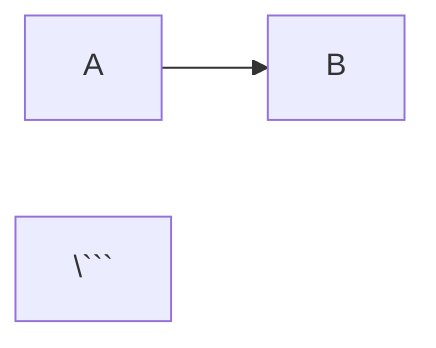

# SmartLinks Architecture Diagrams

Коллекция архитектурных диаграмм проекта SmartLinks в формате Mermaid.js.

## 📊 Диаграммы

### 1. Architecture Overview (Обзорная архитектура)

**Файл:** `architecture-overview.mmd`

**Назначение:** Высокоуровневая схема микросервисной архитектуры для презентаций и документации.

**Показывает:**
- Client Layer
- API Gateway (Nginx)
- Microservices (SmartLinks + JWT)
- Data Layer (MongoDB + Mongo Express)
- Основные потоки данных

**Использование:**
```bash
# Открыть в mermaid.js.org
cat architecture-overview.mmd
```

**Рекомендуется для:**
- Executive presentations
- Технический обзор для новых участников команды
- Документация высокого уровня

---

### 2. Microservices Architecture (Детальная микросервисная архитектура)

**Файл:** `microservices-architecture.mmd`

**Назначение:** Подробная схема всей микросервисной архитектуры с внутренними компонентами.

**Показывает:**
- Client Layer
- API Gateway с маршрутизацией
- JWT Microservice (Node.js) с endpoints
- SmartLinks Microservice (C++) с внутренней структурой:
  - HTTP Layer (Drogon)
  - Middleware Pipeline (405→404→422→307)
  - Business Logic (DSL + Legacy modes)
  - Domain Model (IoC, Adapters, Context)
  - Data Access Layer
- Storage Layer (MongoDB + Mongo Express)
- Все взаимодействия между компонентами

**Использование:**
```bash
# Открыть в mermaid.js.org
cat microservices-architecture.mmd
```

**Рекомендуется для:**
- Технические презентации (16:9 слайд)
- Архитектурная документация
- Онбординг разработчиков
- Code review обсуждения

---

### 3. SmartLinks Internal Architecture (Внутренняя архитектура SmartLinks)

**Файл:** `smartlinks-internal-architecture.mmd`

**Назначение:** Детальная схема внутренней архитектуры SmartLinks микросервиса.

**Показывает:**
- HTTP Layer (DrogonMiddlewareAdapter)
- Middleware Pipeline (Chain of Responsibility)
- Business Logic Layer:
  - DSL Mode (Parser → AST → Evaluator)
  - Legacy Mode (SmartLinkRedirectService)
  - Support Services (FreezeService, JWTValidator)
- Plugin System (Adapter Factory + Adapters)
- Context & IoC Layer
- Domain Model (Interfaces)
- Data Access Layer (Repositories)
- External Dependencies (MongoDB, JWT Service)
- Все внутренние связи и зависимости

**Использование:**
```bash
# Открыть в mermaid.js.org
cat smartlinks-internal-architecture.mmd
```

**Рекомендуется для:**
- Глубокий технический dive
- Разработка новых features
- Рефакторинг планирование
- Plugin development guide

---

### 4. JWT Authorization Flow (Поток JWT авторизации)

**Файл:** `jwt-authorization-flow.mmd`

**Назначение:** Sequence diagram для JWT authentication и authorization flow.

**Показывает:**
- Login flow (получение токенов)
- Authorized request flow (валидация JWT, DSL evaluation)
- Refresh token flow
- Взаимодействия между всеми компонентами
- Альтернативные сценарии (valid/invalid token)

**Использование:**
```bash
# Открыть в mermaid.js.org
cat jwt-authorization-flow.mmd
```

**Рекомендуется для:**
- Security review
- JWT integration documentation
- Troubleshooting authentication issues
- API documentation

---

### 5. SmartLinks C4 Component Diagram (C4 компонентная диаграмма)

**Файл:** `smartlinks-c4-component.mmd`

**Назначение:** C4 Component diagram уровня L3 для SmartLinks микросервиса.

**Показывает:**
- Все компоненты SmartLinks микросервиса (C++)
- Группировка по слоям:
  - HTTP Layer (DrogonMiddlewareAdapter)
  - Middleware Pipeline (405, 404, 422, 307)
  - Business Logic (DSL Parser, Evaluator, JWT Validator)
  - Plugin System (Adapter Factory + Adapters)
  - Core Services (IoC Container, Context)
  - Data Access (Repositories)
- Внешние зависимости (API Gateway, MongoDB, JWT Service)
- Взаимодействия между компонентами
- Dependency Injection потоки
- Легенда с обозначениями

**Использование:**
```bash
# Открыть в mermaid.js.org
cat smartlinks-c4-component.mmd
```

**Рекомендуется для:**
- Технические презентации (C4 model presentation)
- Архитектурная документация (Component level)
- Онбординг разработчиков
- Планирование рефакторинга
- Code review и технический дизайн

**Соответствует:** C4 Model Level 3 (Component Diagram)

**Также доступно в:**
- `smartlinks-c4-component.dsl` - Structurizr DSL формат (для https://structurizr.com)

---

### 5a. SmartLinks C4 Component (Structurizr DSL)

**Файл:** `smartlinks-c4-component.dsl`

**Назначение:** Та же C4 Component диаграмма в формате Structurizr DSL.

**Использование:**

1. **Online (Structurizr Lite):**
   ```bash
   # Открыть https://structurizr.com/dsl
   # Скопировать содержимое smartlinks-c4-component.dsl
   # Вставить в редактор
   ```

2. **Local (Structurizr CLI):**
   ```bash
   # Установить Structurizr CLI
   docker pull structurizr/cli

   # Экспорт в PlantUML
   docker run -v $(pwd):/usr/local/structurizr \
     structurizr/cli export -workspace smartlinks-c4-component.dsl -format plantuml

   # Экспорт в PNG
   docker run -v $(pwd):/usr/local/structurizr \
     structurizr/cli export -workspace smartlinks-c4-component.dsl -format png
   ```

3. **VS Code Extension:**
   - Установить "Structurizr DSL" extension
   - Открыть .dsl файл
   - Preview автоматически

**Преимущества Structurizr DSL:**
- ✅ Официальный формат C4 Model
- ✅ Правильная нотация компонентов
- ✅ Автоматический layout
- ✅ Кастомные стили и цвета
- ✅ Экспорт в PlantUML, PNG, SVG
- ✅ Интеграция с documentation-as-code

**Рекомендуется для:**
- Формальная C4 Model документация
- Автоматическая генерация диаграмм
- CI/CD integration
- Architecture Decision Records (ADR)

---

### 6. DSL Evaluation Flow (Поток выполнения DSL)

**Файл:** `dsl-evaluation-flow.mmd`

**Назначение:** Flowchart процесса парсинга и выполнения DSL правил.

**Показывает:**
- Получение DSL правил из MongoDB
- Создание и заполнение Context
- Парсинг DSL (Tokenization → AST)
- Обработка операторов (AND, OR)
- Primary expressions (LANGUAGE, DATETIME, AUTHORIZED)
- Evaluation процесс
- AUTHORIZED adapter с JWT валидацией
- Результаты (307 Redirect или 429)
- Альтернативные пути выполнения

**Использование:**
```bash
# Открыть в mermaid.js.org
cat dsl-evaluation-flow.mmd
```

**Рекомендуется для:**
- DSL implementation guide
- Debugging DSL rules
- Performance optimization
- Plugin development
- Understanding evaluation order

---

### 7. Integrations Diagram (Диаграмма интеграций)

**Файл:** `integrations.mmd`

**Назначение:** Диаграмма интеграций всех компонентов системы SmartLinks.

**Показывает:**
- Все компоненты: Client Browser, Gateway (Nginx), SmartLinks (C++), JWT Service (Node.js), MongoDB, Mongo Express
- Docker network topology (smartlinks-network)
- Протоколы взаимодействия (HTTP, MongoDB Wire Protocol)
- Published ports и exposed ports
- API endpoints и маршрутизация
- Docker volumes (mongodb_data, jwt_keys)
- External access patterns
- Internal service mesh

**Использование:**
```bash
# Открыть в mermaid.js.org
cat integrations.mmd
```

**Рекомендуется для:**
- DevOps и deployment planning
- Security audit
- Network troubleshooting
- API integration documentation
- Understanding service dependencies
- Docker Compose architecture review

**Документация:** См. [INTEGRATIONS.md](../INTEGRATIONS.md) для детального описания.

---

### 8. DSL Plugin Architecture (Архитектура плагинной системы DSL)

**Файл:** `dsl-plugin-architecture.mmd`

**Назначение:** Упрощённая диаграмма архитектуры плагинной системы для DSL (для презентаций).

**Показывает:**
- Ядро системы: PluginLoader, IoC Container, ParserRegistry, CombinedParser
- Контракт плагина: IParser, IAdapter, IBoolExpression интерфейсы
- Структура плагина (на примере Datetime):
  - DatetimeParser (парсер DSL конструкций)
  - Context2TimePoint (адаптер для доступа к данным)
  - 7 AST узлов (операторы =, !=, <, <=, >, >=, IN)
  - plugin_entry.cpp (регистрация при загрузке)
- Три плагина: Datetime, Language, Authorized
- Потоки: Загрузка → Регистрация → Использование

**Использование:**
```bash
# Открыть в mermaid.js.org
cat dsl-plugin-architecture.mmd
```

**Рекомендуется для:**
- Технические презентации о плагинной архитектуре
- Онбординг разработчиков DSL плагинов
- Архитектурная документация (плагинная система)
- Понимание extensibility модели

---

### 9. DSL Plugin System (Детальная диаграмма плагинной системы)

**Файл:** `dsl-plugin-system.mmd`

**Назначение:** Подробная диаграмма плагинной системы DSL со всеми деталями.

**Показывает:**
- Основная инфраструктура (PluginLoader, IoC, Registry, CombinedParser)
- Шаблон структуры плагина:
  - Слой парсера (IParser реализации)
  - Слой адаптера (интерфейсы + реализации)
  - Слой AST (узлы выражений)
  - plugin_entry.cpp (регистрация/дерегистрация)
- Три конкретных плагина с деталями:
  - **Datetime**: 7 операторов, приоритет 100, ITimePointAccessible
  - **Language**: 2 оператора, приоритет 90, ILanguageAccessible
  - **Authorized**: 1 узел, приоритет 80, IAuthorizedAccessible
- Runtime поток парсинга DSL:
  - DSL String → CombinedParser → OR → AND → Primary → AST Factory → AST Tree
- Жизненный цикл плагина (7 шагов):
  - 1. Загрузка (dlopen)
  - 2. Конструктор (__attribute__((constructor)))
  - 3. Регистрация (IoC + Registry)
  - 4. Использование (Parse → Evaluate)
  - 5. Дерегистрация
  - 6. Деструктор (__attribute__((destructor)))
  - 7. Выгрузка (dlclose)
- Все связи между компонентами

**Использование:**
```bash
# Открыть в mermaid.js.org
cat dsl-plugin-system.mmd
```

**Рекомендуется для:**
- Глубокий технический dive в плагинную систему
- Разработка новых DSL плагинов
- Понимание lifecycle плагинов
- Документация plugin API
- Code review плагинной архитектуры
- Troubleshooting plugin loading issues

---

### 10. Business Process: Redirect (Бизнес-процесс редиректа)

**Файл:** `business-process-redirect.mmd`

**Назначение:** Flowchart основного бизнес-процесса - обработка HTTP запроса по умной ссылке.

**Показывает:**
- Полный путь от HTTP запроса пользователя до редиректа на целевой URL
- API Gateway (Nginx) маршрутизация
- Создание Request Scope (IoC контейнер)
- Middleware Pipeline:
  - M405: Проверка метода (GET/HEAD only)
  - M404: Проверка существования ссылки
  - M422: Проверка состояния (не заморожена)
  - M307: Логика редиректа
- DSL Processing:
  - 1. Load Rules (MongoDB query)
  - 2. Parse DSL (Text → AST)
  - 3. Fill Context (Accept-Language, time, JWT)
  - 4. Evaluate AST (условия → bool)
  - AUTHORIZED: JWT validation через JWKS
- Все возможные результаты:
  - ✅ 307 Temporary Redirect
  - ❌ 404 Not Found
  - ❌ 405 Method Not Allowed
  - ❌ 422 Unprocessable Entity
  - ❌ 429 Too Many Requests
- Взаимодействие с внешними системами (MongoDB, JWT Service)

**Использование:**
```bash
# Открыть в mermaid.js.org
cat business-process-redirect.mmd
```

**Рекомендуется для:**
- Бизнес-презентации (понятно нетехническим stakeholders)
- Онбординг новых разработчиков
- Понимание end-to-end процесса
- Troubleshooting проблем с редиректами
- Документация для QA и тестирования
- Обучение пользователей системы

**Документация:** См. [doc/BUSINESS_PROCESSES.md](../doc/BUSINESS_PROCESSES.md) для детального описания.

---

### 11. Business Process: JWT Authentication (Бизнес-процесс JWT аутентификации)

**Файл:** `business-process-jwt-auth.mmd`

**Назначение:** Flowchart процесса JWT аутентификации и использования токенов.

**Показывает:**
- **Login Flow** - получение access и refresh токенов:
  - POST /jwt/login → Gateway → JWT Service
  - Валидация credentials в MongoDB users
  - Генерация токенов (Access 10min, Refresh 14days, RS256)
  - Сохранение refresh token в MongoDB
  - ✅ 200 OK с токенами или ❌ 401 Invalid credentials
- **Token Usage Flow** - использование access token для доступа к premium контенту:
  - GET /link с Authorization header
  - SmartLinks валидирует JWT через JWKS endpoint
  - ✅ 307 Redirect на premium контент или ❌ 429 на signup
- **Refresh Flow** - обновление access token без повторного ввода пароля:
  - POST /jwt/refresh с refresh_token
  - Проверка refresh token в MongoDB
  - ✅ Новый access token или ❌ 401 Invalid refresh

**Использование:**
```bash
# Открыть в mermaid.js.org
cat business-process-jwt-auth.mmd
```

**Рекомендуется для:**
- Понимание JWT lifecycle (login → use → refresh)
- Интеграция с JWT микросервисом
- Security audit и review
- Документация для фронтенд разработчиков
- Troubleshooting authentication issues

---

### 12. Business Process: Create SmartLink (Бизнес-процесс создания SmartLink)

**Файл:** `business-process-create-link.mmd`

**Назначение:** Flowchart процесса создания новой умной ссылки.

**Показывает:**
- **Preparation** - подготовка данных:
  - Define Alias (уникальный идентификатор ссылки)
  - Write DSL Rules (условия редиректа)
- **Validation** - валидация DSL правил:
  - DSL Parser проверяет синтаксис каждого правила
  - ✅ Valid syntax или ❌ Invalid DSL error
- **MongoDB Insert** - вставка в базу данных:
  - Проверка уникальности alias
  - ✅ Новый alias → успешная вставка
  - ❌ Duplicate alias → ошибка
- **Testing** - проверка работоспособности:
  - GET /alias
  - ✅ 307 Redirect подтверждает корректность

**Использование:**
```bash
# Открыть в mermaid.js.org
cat business-process-create-link.mmd
```

**Рекомендуется для:**
- Онбординг контент-менеджеров
- Документация Admin Panel
- Валидация workflow
- Понимание бизнес-правил создания ссылок
- QA тестирование

---

### 13. Business Process: Manage DSL Rules (Бизнес-процесс управления правилами DSL)

**Файл:** `business-process-manage-rules.mmd`

**Назначение:** Flowchart процесса управления DSL правилами существующей ссылки.

**Показывает:**
- **Add Rule Flow** - добавление нового правила:
  - Write Condition (DSL выражение)
  - Write URL (целевой адрес)
  - Validate DSL syntax
  - $push в MongoDB (добавление в начало списка)
  - ✅ Rule Added
- **Update Rule Flow** - изменение существующего правила:
  - Select Rule (выбор правила для изменения)
  - Modify URL (изменение целевого URL)
  - Validate Change
  - $set в MongoDB (обновление поля)
  - ✅ Rule Updated
- **Delete Rule Flow** - удаление правила:
  - Confirm Delete (подтверждение удаления)
  - $pull из MongoDB (удаление из массива)
  - ✅ Rule Deleted
- **Testing** - проверка изменений:
  - 🧪 Test Changes
  - ✅ 307 Works подтверждает корректность

**Использование:**
```bash
# Открыть в mermaid.js.org
cat business-process-manage-rules.mmd
```

**Рекомендуется для:**
- Документация CRUD операций над правилами
- Понимание приоритета правил (порядок важен!)
- Workflow для контент-менеджеров
- API design для Admin Panel
- Troubleshooting проблем с правилами

---

### 14. Business Process: Freeze/Unfreeze (Бизнес-процесс Freeze/Unfreeze)

**Файл:** `business-process-freeze.mmd`

**Назначение:** Flowchart процесса временного отключения и активации ссылки.

**Показывает:**
- **Freeze Flow** - заморозка ссылки:
  - ❄️ Freeze Link
  - Specify Reason (причина заморозки: maintenance, incident, etc.)
  - Confirm Freeze
  - $set is_frozen=true в MongoDB
  - 📧 Notify Team (уведомление команды)
  - 🧪 Test: GET /alias → ✅ 422 Unprocessable Entity
- **Unfreeze Flow** - разморозка ссылки:
  - ☀️ Unfreeze Link
  - Check Reason (проверка устранения причины)
  - Confirm Unfreeze
  - $set is_frozen=false в MongoDB
  - 📧 Notify Team
  - 🧪 Test: GET /alias → ✅ 307 Redirect (работает нормально)
- Возможность отмены операции (❌ Cancelled)

**Использование:**
```bash
# Открыть in mermaid.js.org
cat business-process-freeze.mmd
```

**Рекомендуется для:**
- Incident response procedures
- Maintenance workflow
- Документация для DevOps
- Understanding link lifecycle states
- Troubleshooting 422 errors

---

## 📋 Сводная таблица диаграмм

| # | Диаграмма | Формат | Тип | Назначение | Уровень детализации |
|---|-----------|--------|-----|------------|---------------------|
| 1 | architecture-overview.mmd | Mermaid | Graph | Обзорная архитектура | High-level (Executive) |
| 2 | microservices-architecture.mmd | Mermaid | Graph | Детальная микросервисная архитектура | Detailed (Technical) |
| 3 | smartlinks-internal-architecture.mmd | Mermaid | Graph | Внутренняя архитектура SmartLinks | Very detailed (Implementation) |
| 4 | jwt-authorization-flow.mmd | Mermaid | Sequence | JWT authentication flow | Process flow |
| 5 | **smartlinks-c4-component.mmd** | **Mermaid** | **C4 Component** | **C4 L3 компонентная диаграмма** | **Component level** |
| 5a | **smartlinks-c4-component.dsl** | **Structurizr** | **C4 Component** | **C4 L3 (Structurizr DSL)** | **Component level** |
| 6 | dsl-evaluation-flow.mmd | Mermaid | Flowchart | DSL парсинг и выполнение | Algorithm flow |
| 7 | **integrations.mmd** | **Mermaid** | **Graph** | **Интеграции и IPC** | **Deployment & Integration** |
| 8 | **dsl-plugin-architecture.mmd** | **Mermaid** | **Graph** | **Архитектура плагинов (упрощ.)** | **Plugin system (simplified)** |
| 9 | **dsl-plugin-system.mmd** | **Mermaid** | **Graph** | **Плагинная система (детально)** | **Plugin system (detailed)** |
| 10 | **business-process-redirect.mmd** | **Mermaid** | **Flowchart** | **Бизнес-процесс редиректа** | **Business process** |
| 11 | **business-process-jwt-auth.mmd** | **Mermaid** | **Flowchart** | **JWT аутентификация** | **Business process** |
| 12 | **business-process-create-link.mmd** | **Mermaid** | **Flowchart** | **Создание SmartLink** | **Business process** |
| 13 | **business-process-manage-rules.mmd** | **Mermaid** | **Flowchart** | **Управление правилами DSL** | **Business process** |
| 14 | **business-process-freeze.mmd** | **Mermaid** | **Flowchart** | **Freeze/Unfreeze ссылки** | **Business process** |

---

## 🛠️ Как использовать

### Вариант 1: Online Editor (mermaid.js.org)

1. Открыть https://mermaid.js.org/
2. Выбрать "Live Editor"
3. Скопировать содержимое .mmd файла
4. Вставить в редактор
5. Экспортировать как PNG/SVG

### Вариант 2: Mermaid CLI

```bash
# Установить mermaid-cli
npm install -g @mermaid-js/mermaid-cli

# Сгенерировать PNG
mmdc -i architecture-overview.mmd -o architecture-overview.png -w 1920 -H 1080

# Сгенерировать SVG
mmdc -i architecture-overview.mmd -o architecture-overview.svg
```

### Вариант 3: GitHub/GitLab

GitHub и GitLab автоматически рендерят Mermaid диаграммы в markdown:

```markdown


### Вариант 4: VS Code Extension

1. Установить расширение "Markdown Preview Mermaid Support"
2. Открыть .mmd файл
3. Нажать Ctrl+Shift+V для preview

---

## 📐 Соотношения сторон

Все диаграммы оптимизированы для:

- **16:9** - презентационные слайды (рекомендуется)
- **4:3** - документация (альтернатива)

Рекомендуемые разрешения для экспорта:
- **Full HD:** 1920x1080 (16:9)
- **4K:** 3840x2160 (16:9)
- **A4 Landscape:** 297x210 mm

---

## 🎨 Цветовая схема

| Компонент | Цвет | Hex |
|-----------|------|-----|
| Client Layer | Голубой | #e1f5ff |
| API Gateway | Оранжевый | #fff3e0 |
| Microservices | Фиолетовый | #f3e5f5 |
| Data Layer | Зеленый | #e8f5e9 |
| Internal Components | Розовый | #fce4ec |

---

## 🔄 Обновление диаграмм

При изменении архитектуры:

1. Обновить соответствующий .mmd файл
2. Проверить корректность в mermaid.js.org
3. Обновить экспортированные PNG/SVG (если используются)
4. Обновить документацию с датой изменения

---

## 📝 Формат файлов

- **`.mmd`** - исходный код Mermaid
- **`.png`** - растровое изображение (для презентаций)
- **`.svg`** - векторное изображение (для печати)

---

## 🔗 Связанная документация

- [ARCHITECTURE.md](../ARCHITECTURE.md) - Подробная архитектурная документация
- [GATEWAY.md](../GATEWAY.md) - Документация API Gateway
- [JWT.md](../JWT.md) - Документация JWT сервиса
- [INTEGRATIONS.md](../INTEGRATIONS.md) - Документация интеграций и IPC
- [README.md](../README.md) - Главная документация проекта

---

## 📚 Ресурсы

- **Mermaid.js Documentation:** https://mermaid.js.org/
- **Mermaid Live Editor:** https://mermaid.live/
- **Mermaid CLI:** https://github.com/mermaid-js/mermaid-cli
- **Syntax Reference:** https://mermaid.js.org/intro/syntax-reference.html

---

**Автор:** Claude Code
**Дата создания:** 2026-03-16
**Последнее обновление:** 2026-03-16
**Версия:** 1.0.0
